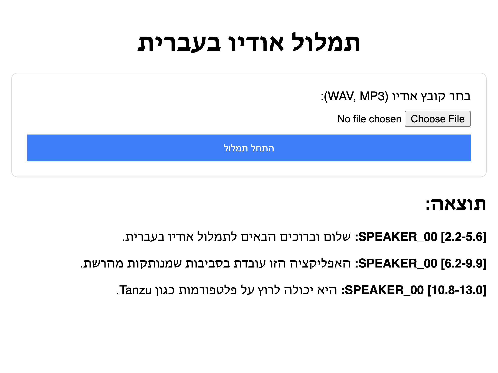

# 🎙️ Hebrew Whispers: Air-Gapped WhisperX Service

A production-ready, Dockerized web application for high-accuracy Hebrew audio transcription, alignment, and speaker diarization. Built to run in **fully air-gapped environments** (offline) on **Tanzu Platform**.



## 🚀 Features

*   **Offline First**: All models (Whisper, VAD, Alignment, Diarization) are baked into the Docker image. Zero internet access required at runtime.
*   **Hebrew Optimized**: Pre-configured with `large-v3` model and specific Hebrew alignment models (`imvladikon/wav2vec2-xls-r-300m-hebrew`).
*   **Advanced Pipeline**:
    *   **Transcription**: Faster-Whisper (Large-v3)
    *   **VAD**: Silero VAD (Monkeypatched for offline use)
    *   **Alignment**: Wav2Vec2 (Character-level timestamp accuracy)
    *   **Diarization**: Pyannote Audio 3.1 (Speaker identification)
*   **Async Processing**: Built-in job queue to handle long audio files without HTTP timeouts.
*   **User Interface**: Simple, responsive web UI for file uploads and result viewing.

## 🛠️ Architecture

*   **Backend**: Python 3.10, FastAPI, Uvicorn.
*   **Processing**: `whisperx` library with custom wrapper classes to bypass strictly online dependencies (like standard Pyannote/HuggingFace loaders).
*   **Deployment**: Docker container running as non-root user (Tanzu security compliant).

## 📦 Installation & Usage

### 1. Download Models Locally
Since the environment is air-gapped, you must download models on a connected machine first.

```bash
# Export HF_TOKEN if you have access to gated Pyannote models (optional but recommended for Diarization)
export HF_TOKEN=your_token

# Run the helper script (uses Docker to download models, keeping your local env clean)
chmod +x download_models_docker.sh
./download_models_docker.sh
```

*Alternatively, you can install dependencies `pip install huggingface_hub faster-whisper torch whisperx` and run `python download_models.py` manually.*

### 2. Build Docker Image
**Note for Mac Users (M1/M2/M3):** You must build for `linux/amd64` to run on most servers/Tanzu.

```bash
# Build for deployment (x86_64)
docker build --platform linux/amd64 -t your-registry/hebrew-whispers:v1 .

# Push to your registry
docker push your-registry/hebrew-whispers:v1
```

**Optimization:** The `Dockerfile` is layered so that the heavy `models/` directory (6GB+) is cached before the application code. Code changes will result in fast 10MB pushes, not 6GB pushes.

### 2b. Build with CUDA/GPU Support (Optional)
For significantly faster transcription on machines with NVIDIA GPUs, use the CUDA-enabled Dockerfile:

```bash
# Build CUDA image for deployment (x86_64)
docker buildx build --platform linux/amd64 -f Dockerfile.cuda -t your-registry/hebrew-whispers:v1-cuda --load .

# Push to your registry
docker push your-registry/hebrew-whispers:v1-cuda
```

**Host Requirements:**
- NVIDIA GPU with CUDA support
- NVIDIA Driver (525+)
- [NVIDIA Container Toolkit](https://docs.nvidia.com/datacenter/cloud-native/container-toolkit/install-guide.html) (`nvidia-docker2`)

**Running with GPU:**
```bash
docker run --gpus all -p 8080:8080 your-registry/hebrew-whispers:v1-cuda
```

The application auto-detects CUDA availability and will use GPU acceleration with `float16` precision when available, falling back to CPU with `int8` precision otherwise.

### 3. Deploy
Deploy to your platform (e.g., Cloud Foundry / Tanzu):

```bash
cf push
```

## 📝 Configuration

*   **`MODELS_PATH`**: Path to models folder inside container (Default: `/app/models`)
*   **`PORT`**: Application port (Default: `8080` or set by platform)

## 🔧 Technical Details (The "Secret Sauce")
To make `whisperx` run offline, we had to "monkeypatch" several components:
1.  **VAD Loading**: Overridden `whisperx.vad.load_vad_model` to load Silero VAD from a local `torch.hub` cache instead of downloading at runtime.
2.  **Transformers**: Patched `Wav2Vec2Processor` to fix compatibility issues with newer library versions.
3.  **Pyannote**: Custom configuration rewriting to point to local `pytorch_model.bin` files instead of Hugging Face Hub IDs.

## 📄 License
Apache 2.0
